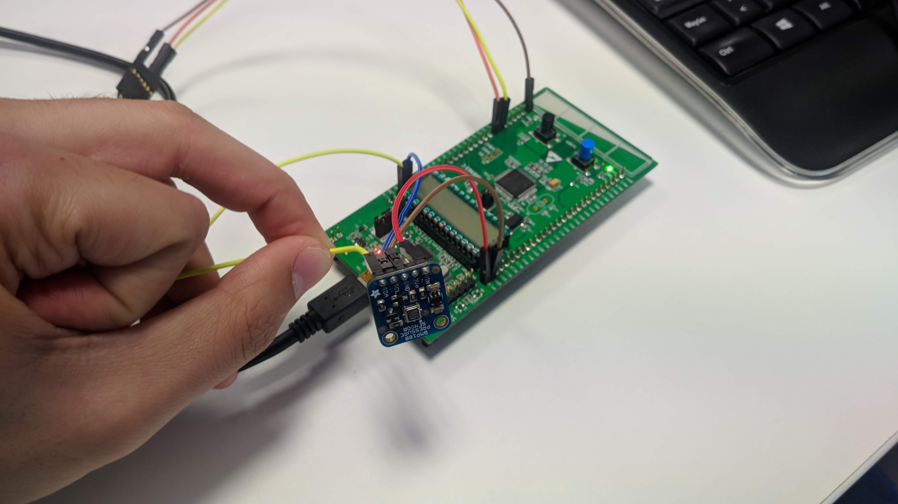

This document wants to be a small guideline for rapidly start using
the defconfig files we at ALR have updated. This `.defconfig` uses the
NuttX version 7.26.

Available example list

# Olimex STM32-E407

+ [x] NSH and NSH over USB
+ [x] BMP180
+ [x] HIH6130
+ [x] TCP Echo
+ [x] UDP Echo
+ [x] ADC
+ [x] Telemetry
 + [x] INA219 current sensor, this sensor is used in the example above
+ [x] Power Manager
+ [x] USB NSH
+ [ ] SD Card => Not working right
+ [ ] 802.15.4 => Not working right

# STM32L Discovery

To be tested and updated!

+ [x] NSH
+ [x] BMP180
+ [x] HIH6130
+ [x] Power Manager
+ [ ] SPI working, tested under MRF24J40

### Repository to be used

For the examples listed below, please make use of the branch called `NuttX_7.26` for NuttX folder, found at [GitHub](https://github.com/microROS/Nuttx/tree/NuttX_7.26), and the `apps_7.26` [GitHub branch](https://github.com/microROS/apps/tree/apps_7.26) for the apps folder. Pull the branches in case you are working under the provided Dockerfiles.

----------------------

# How to execute NSH under STM32L Discovery

First, clean the old compilations you are using:
`$ cd nuttx`
`$ make distclean`

Copy the `.config` file created for the example:
`cd nuttx/tools`
`sh configure.sh configs/stm32ldiscovery/nsh`
You should see this output in the terminal:

```
root@2ca837544dc0:~/nuttx/tools# sh configure.sh configs/stm32ldiscovery/nsh
 Copy files
 Refreshing...
```
Finally, compile the example:
`cd .. && make`

Now upload the code to the board:
`openocd -f interface/stlink-v2.cfg -f target/stm32l1.cfg -c init -c "reset halt" -c "flash write_image erase nuttx.bin 0x08000000"`

Connect the serial cable `RX` to pin `PA9` and `TX` to pin `PA10` and the GND wire to a `GND` pin. Attach the micro USB cable in order to upload the firmware:


Open a new terminal and use a serial client, i.e. `minicom` to open the serial port, `sudo minicom -D /dev/ttyUSB0`. Once done, you should be able to see how `NSH` pops up when pressing key:

```
nsh>
nsh>
nsh>
nsh> ?
help usage:  help [-v] [<cmd>]

  ?           exec        hexdump     mb          sleep       
  cat         exit        kill        mh          usleep      
  echo        help        ls          mw          xd          

Builtin Apps:
nsh>
```


# How to execute BMP180 example

First, clean the old compilations you are using:
`$ cd nuttx`
`$ make distclean`

### Olimex STM32-E407

Copy the `.config` file created for the example:
`cd nuttx/tools`
`sh configure.sh olimex-stm32-e407/bmp180`


### STM32L Discovery

Afterwards, copy the `.config` file created for the example:
`cd nuttx/tools`
`sh configure.sh stm32ldiscovery/bmp180`


You should see this output in the terminal:

```
root@2ca837544dc0:~/nuttx/tools# sh configure.sh olimex-stm32-e407/bmp180
 Copy files
 Refreshing...
```
Finally, compile the example:
`cd .. && make`

Now upload the code to the board. In case using the Olimex board, use this command:
`openocd -f interface/ftdi/olimex-arm-usb-tiny-h.cfg -f target/stm32f4x.cfg -c init -c "reset halt" -c "flash write_image erase nuttx.bin 0x08000000"`

Or this one, in case of the STM32L Discovery:
`openocd -f interface/stlink-v2.cfg -f target/stm32l1.cfg -c init -c "reset halt" -c "flash write_image erase nuttx.bin 0x08000000"`


###  Olimex
Connect the sensor, as in the attached image:


### STM32L Discovery

Place Serial debugger RX(PA10), TX(PA9) and GND to GND, and connect the sensor `Vin` to `EXT_5V`, `GND` to `GND`, `SCL` to `PB9` and `SDA` to `PB8` (Board pin names, in silkscreen). For feeding the  sensor use the `EXT_5V` pin. Like in the image below:



In a new terminal, open a serial session attached to your serial cable, once you have done it, press "RESET" button. You should see NuttX console popping up:

```
NuttShell (NSH)                                                                 
nsh>
```
Now type `?`  command for checking if the example binary is there:

```
nsh> ?                                                                          
help usage:  help [-v] [<cmd>]                                                  

 [           cmp         false       mkdir       rm          true              
 ?           dirname     free        mh          rmdir       uname             
 basename    dd          help        mount       set         umount            
 break       df          hexdump     mv          sh          unset             
 cat         echo        kill        mw          sleep       usleep            
 cd          exec        ls          ps          test        xd                
 cp          exit        mb          pwd         time                          

Builtin Apps:                                                                   
 adc_simple                                                                    
 hello                                                                         
 helloxx                                                                       
 bmp180
```

Now, execute the example:

`nsh>bmp180`
This is the expected outoput:
```
Pressure: 95988                                                                 
Pressure: 95987                                                                 
Pressure: 95987                                                                 
Pressure: 95985                                                                 
Pressure: 95988
```

# How to execute HIH6130 example


First, clean the old compilations you are using:
`$ cd nuttx`
`$ make distclean`

### Olimex

Copy the `.config` file created for the example:
`cd nuttx/tools`
`sh configure.sh olimex-stm32-e407/hih6130`

### STM32L Discovery

If you use the board STM32L Discovery, copy the `.config` file created for the example:
`cd nuttx/tools`
`sh configure.sh configs/stm32ldiscovery/hih6130`

You should see this output in the terminal:

```
root@2ca837544dc0:~/nuttx/tools# sh configure.sh olimex-stm32-e407/hih6130
 Copy files
 Refreshing...
```
Finally, compile the example:
`cd .. && make`

Now upload the code to the board:

In case of using the Olimex board:
`openocd -f interface/ftdi/olimex-arm-usb-tiny-h.cfg -f target/stm32f4x.cfg -c init -c "reset halt" -c "flash write_image erase nuttx.bin 0x08000000"`

Or this one, in case of the STM32L Discovery:
`openocd -f interface/stlink-v2.cfg -f target/stm32l1.cfg -c init -c "reset halt" -c "flash write_image erase nuttx.bin 0x08000000"`

### Hardware connection

### Olimex

Connect the sensor as in the attached image:


Sensor `SDA` to `CON3` header `D0` pin
Sensor `SCL` to `CON3` header `D1` pin

Sensor `VIN` to `PD` header `19` pin
Sensor `GND` to `PD` header `20` pin

### STM32L Discovery

Connect the sensor as in the attached image:


Place Serial debugger RX(PA10), TX(PA9) and GND to GND, and connect the sensor `Vin` to `EXT_5V`, `GND` to `GND`, `SCL` to `PB9` and `SDA` to `PB8` (Board pin names, in silkscreen). For feeding the  sensor use the `EXT_5V` pin.

In a new terminal, open a serial session attached to your serial cable, once you have done it, press "RESET" button. You should see NuttX console popping up:

```
NuttShell (NSH)                                                                 
nsh>
```
Now type `?`  command for checking if the example binary is there:

```
nsh> ?                                                                          
help usage:  help [-v] [<cmd>]                                                  

 [           cmp         false       mkdir       rm          true              
 ?           dirname     free        mh          rmdir       uname             
 basename    dd          help        mount       set         umount            
 break       df          hexdump     mv          sh          unset             
 cat         echo        kill        mw          sleep       usleep            
 cd          exec        ls          ps          test        xd                
 cp          exit        mb          pwd         time                          

Builtin Apps:                                                                   
 adc_simple                                                                    
 hello                                                                         
 helloxx                                                                       
 hih6130
```

Now, execute the example:

`nsh>hih6130`
This is the expected outoput:
```
nsh> hih6130                                                                    
Temperature: 31 �ºC Humidity: 49                                                
Temperature: 31 �ºC Humidity: 45                                                
Temperature: 31 �ºC Humidity: 44                                                
Temperature: 31 �ºC Humidity: 44
```

# How to use NSH over USB


First, clean the old compilations you are using:
`$ cd nuttx`
`$ make distclean`

Copy the `.config` file created for the example:
`cd nuttx/tools`
`./configure.sh olimex-stm32-e407/usbnsh`
You should see this output in the terminal:

```
root@2ca837544dc0:~/nuttx/tools# ./configure.sh olimex-stm32-e407/telemetry
  Copy files
  Refreshing...
```

Finally, compile the example:
`cd .. && make`

Now upload the code to the board:
```
openocd -f interface/ftdi/olimex-arm-usb-tiny-h.cfg -f target/stm32f4x.cfg -c init -c "reset halt" -c "flash write_image erase nuttx.bin 0x08000000"
```

Attach the mini-USB connector to the `USB_OTG_1` connector, as the next image:


In order to know which USB port has assigned Linux, type `dmesg` and search for these:
```
[13234.885967] usb 3-1: new full-speed USB device number 14 using xhci_hcd
[13235.035127] usb 3-1: New USB device found, idVendor=0525, idProduct=a4a7
[13235.035130] usb 3-1: New USB device strings: Mfr=1, Product=2, SerialNumber=3
[13235.035132] usb 3-1: Product: CDC/ACM Serial
[13235.035134] usb 3-1: Manufacturer: NuttX
[13235.035136] usb 3-1: SerialNumber: 0
[13235.035749] cdc_acm 3-1:1.0: ttyACM0: USB ACM device
```

Once you know the interface, open a `minicom` session at that port and hit `Enter` three times to pop-up `NSH`:

```
NuttShell (NSH)
nsh> ?
help usage:  help [-v] [<cmd>]

  [           cmp         false       mkdir       rm          true        
  ?           dirname     free        mh          rmdir       uname       
  basename    dd          help        mount       set         umount      
  break       df          hexdump     mv          sh          unset       
  cat         echo        kill        mw          sleep       usleep      
  cd          exec        ls          ps          test        xd          
  cp          exit        mb          pwd         time        

Builtin Apps:
  helloxx
  adc_simple
  hello
nsh>
```

More Resources: https://www.youtube.com/watch?v=5BznGFvodmg


# How to execute telemetry app

Telemetry app ables to read the current measurement using INA219, CPU load and RAM size NuttX is using. For running this example you will require the INA219 connected to the bus `I2C1`, serial cable connected to `UART3` and the Olimex flashing tool attached:


First, clean the old compilations you are using:
`$ cd nuttx`
`$ make distclean`

Copy the `.config` file created for the example:
`cd nuttx/tools`
`./configure.sh olimex-stm32-e407/telemetry`
You should see this output in the terminal:

```
root@2ca837544dc0:~/nuttx/tools# ./configure.sh olimex-stm32-e407/telemetry
  Copy files
  Refreshing...
```

Finally, compile the example:
`cd .. && make`

Now upload the code to the board:
```
openocd -f interface/ftdi/olimex-arm-usb-tiny-h.cfg -f target/stm32f4x.cfg -c init -c "reset halt" -c "flash write_image erase nuttx.bin 0x08000000"
```
Once the code it's upload to the board, do the next steps:
+ Check if the example is there, type `?`, you should see a binary called `telemetry`

```
nsh>?
help usage:  help [-v] [<cmd>]

  [           dirname     help        mh          set         unset       
  ?           dd          hexdump     mount       sh          usleep      
  basename    df          kill        mv          sleep       xd          
  break       echo        ls          mw          test        
  cat         exec        mb          ps          time        
  cd          exit        mkdir       pwd         true        
  cp          false       mkfatfs     rm          uname       
  cmp         free        mkrd        rmdir       umount                                                                      

Builtin Apps:                                                                                                                 
  telemetry                                                                                                                   
  helloxx                                                                                                                     
  adc_simple                                                                                                                  
  hello
```

+ Now check its usage typing just `telemetry`:

```
nsh>telemetry                                                                                                                 
Correct: telemetry file.txt number_measures show_option                                                                       
If you want a continue measure, write i as argument                                                                           
The available options are:                                                                                                    
 s (to save in the sd card)                                                                                                   
c (to see the data in the console)                                                                                            
 b (both modes)

```

In this example, we are not going to store any file with the measurements, but we need to type it.
Execute the next command:  `telemetry file.txt 10 c` to see 10 reads in the console.
The output should be something like this:

```
nsh>telemetry file.txt 10 c                                                                                                   
nsh: mount: mount failed: 19                                                                                                  
Starting telemetry SD                                                                                                         
V: 1028000 mV I: 4294966496 mA CPU:   0.01000235516tal       used       free    largest                                       
Umem:       127072      17088     109984     105968                                                                           
�tK��Q Free SRAM: 109984 Bytes                                                                                                
V: 1024000 mV I: 4294966496 mA CPU:   0.01000235516tal       used       free    largest                                       
Umem:       127072      17088     109984     105968                                                                           
�tK�����Q Free SRAM: 109984 Bytes                                                                                             
V: 1028000 mV I: 4294966696 mA CPU:   0.01000235516tal       used       free    largest                                       
Umem:       127072      17088     109984     105968                                                                           
�tK��Q Free SRAM: 109984 Bytes                                                                                                
V: 1024000 mV I: 4294966396 mA CPU:   0.01000235516tal       used       free    largest                                       
Umem:       127072      17088     109984     105968                                                                           
�tK�����Q Free SRAM: 109984 Bytes                                                                                             
V: 1024000 mV I: 4294966296 mA CPU:   0.01000235516tal       used       free    largest                                       
Umem:       127072      17088     109984     105968                                                                           
�tK��Q Free SRAM: 109984 Bytes                                                                                                
V: 1024000 mV I: 4294966896 mA CPU:   0.01000235516tal       used       free    largest                                       
Umem:       127072      17088     109984     105968                                                                           
�tK�����Q Free SRAM: 109984 Bytes                                                                                             
V: 1024000 mV I: 4294966596 mA CPU:   0.01000235516tal       used       free    largest                                       
Umem:       127072      17088     109984     105968                                                                           
�tK��Q Free SRAM: 109984 Bytes                                                                                                
V: 1028000 mV I: 4294966496 mA CPU:   0.01000235516tal       used       free    largest                                       
Umem:       127072      17088     109984     105968                                                                           
�tK�����Q Free SRAM: 109984 Bytes                                                                                             
V: 1024000 mV I: 4294966696 mA CPU:   0.01000235516tal       used       free    largest                                       
Umem:       127072      17088     109984     105968                                                                           
�tK��Q Free SRAM: 109984 Bytes                                                                                                
V: 1028000 mV I: 4294966796 mA CPU:   0.01000235516tal       used       free    largest                                       
Umem:       127072      17088     109984     105968                                                                           
�tK�����Q Free SRAM: 109984 Bytes
```
*Note: It is not required to add SD card to run the example. But you can add it and create a logfile*
*Note: Current and Voltage measurements are weird because I haven't attached anything*
*Note: This test needs improvements*

# How to execute UDPEcho server example


First, clean the old compilations you are using:
`$ cd nuttx`
`$ make distclean`

Copy the `.config` file created for the example:
`cd nuttx/tools`
`./configure.sh olimex-stm32-e407/udpecho`
You should see this output in the terminal:

```
root@2ca837544dc0:~/nuttx/tools# ./configure.sh olimex-stm32-e407/udpecho
  Copy files
  Refreshing...
```

Finally, compile the example:
`cd .. && make`

Now upload the code to the board:
```
openocd -f interface/ftdi/olimex-arm-usb-tiny-h.cfg -f target/stm32f4x.cfg -c init -c "reset halt" -c "flash write_image erase nuttx.bin 0x08000000"
```
Once the code it's upload to the board, do the next steps:
- Connect the ethernet cable to the ethernet port of the board.
- Connect the serial cable to USART 3 of the board (You can see in the next image where it is).


- Configure the console with a baudrate of 115200 bauds.
- Once you open the console you should check if the app was correctly upload typing `?` and you should see this:


- Then type `ifup eth0` to bring up the network:


- Mount the file system of NuttX typing `mount -t procfs /proc`
- See which IP was assigned to your board typing `ifconfig` and you should see this:


With this command, you can see statistics of the network, the IP of the board, the state of the connection...
In this case was assigned the IP: 192.168.1.35
**By default this board will use the port 80.** To change it, you must do in the code of the app

- The last step in the board side is to type `udpecho` to run the udp echo server.
-Then in the computer side, use an app like netcat typing the next command: `netcat -u 192.168.1.35 80`

Now if you type something in the computer, the board should echo the same and show the data of the messages like this image:

**Computer side**


**Board side**


# How to execute TCP Echo server example


First, clean the old compilations you are using:
`$ cd nuttx`
`$ make distclean`

Copy the `.config` file created for the example:
`cd nuttx/tools`
`./configure.sh olimex-stm32-e407/tcpecho`
You should see this output in the terminal:

```
root@2ca837544dc0:~/nuttx/tools# ./configure.sh olimex-stm32-e407/tcpecho
  Copy files
  Refreshing...
```

Finally, compile the example:
`cd .. && make`

Now upload the code to the board:
```
openocd -f interface/ftdi/olimex-arm-usb-tiny-h.cfg -f target/stm32f4x.cfg -c init -c "reset halt" -c "flash write_image erase nuttx.bin 0x08000000"
```

Connect the ethernet cable to the ethernet port of the board.

*Note:This example has been made with a router in the middle of the computer and the Olimex board.*

In a new terminal, open a serial session attached to your serial cable, once you have done it, press "RESET" button. You should see this message announcing that the echo server it's started:
```
Start Echo Server

```

Then in your computer you can open an TCP/Ip client with the next command in the console:
` netcat -t 192.168.1.133 80`

This command connects to the IP 192.168.1.133 and the port 80

Now right some characters in the terminal:

```
~$ netcat -t 192.168.1.133 80
sfd
sfd
aaa
aaa
jjj
jjj
```

At the client, in your computer, you should see the reply of what you're writing.

If you want to check or modify the connection data  you can do in the next path:
`make menuconfig`

`Application configuration`

`Examples`

And you will see something like this:


This show the IP direction, the netmask and the router IP in HEX and the port to connect.

The variables are shown in two hexadecimal numbers per each field. In case of the IP:
`0xCA` = 192

`0xA8` = 168

`0x01` = 1

`0x85` = 133

# How to execute Power Manager example

This example is simple, after some seconds, the boards enter into a sleep mode that could be re-waken up, writing into the serial season. Some data is lost, until the complete wake up is done.


First, clean the old compilations you are using:
`$ cd nuttx`
`$ make distclean`

Copy the `.config` file created for the example:
`cd nuttx/tools`
`./configure.sh configs/olimex-stm32-e407/pm`

Or the one placed in the STM32L Discovery in the case you want to use this:
`cd nuttx/tools`
`./configure.sh  configs/stm32ldiscovery//pm`

You should see this output in the terminal:

```
root@2ca837544dc0:~/nuttx/tools# ./configure.sh olimex-stm32-e407/pm
  Copy files
  Refreshing...
```

Finally, compile the example:
`cd .. && make`

For the Olimex board, now upload the code to the board:
```
openocd -f interface/ftdi/olimex-arm-usb-tiny-h.cfg -f target/stm32f4x.cfg -c init -c "reset halt" -c "flash write_image erase nuttx.bin 0x08000000"
```

For the STM32L1 Discovery board, execute the next command:
`openocd -f interface/stlink-v2.cfg -f target/stm32l1.cfg -c init -c "reset halt" -c "flash write_image erase nuttx.bin 0x08000000"`

Now open a serial session for connecting to the board. Once the prompt pops-up, do not type for some seconds and you will see that in a point, if you type something, it will not appear at the command line. After some seconds, the command line will again work properly.
