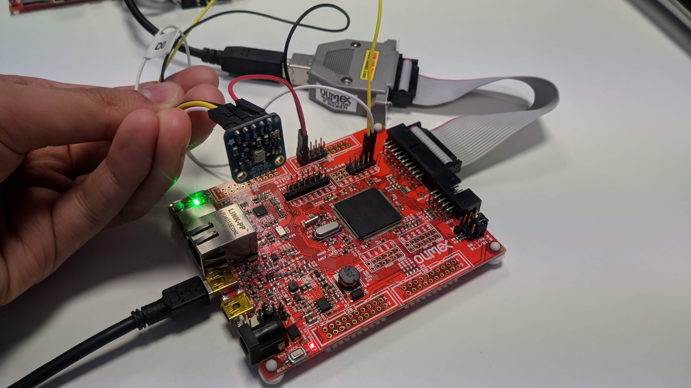
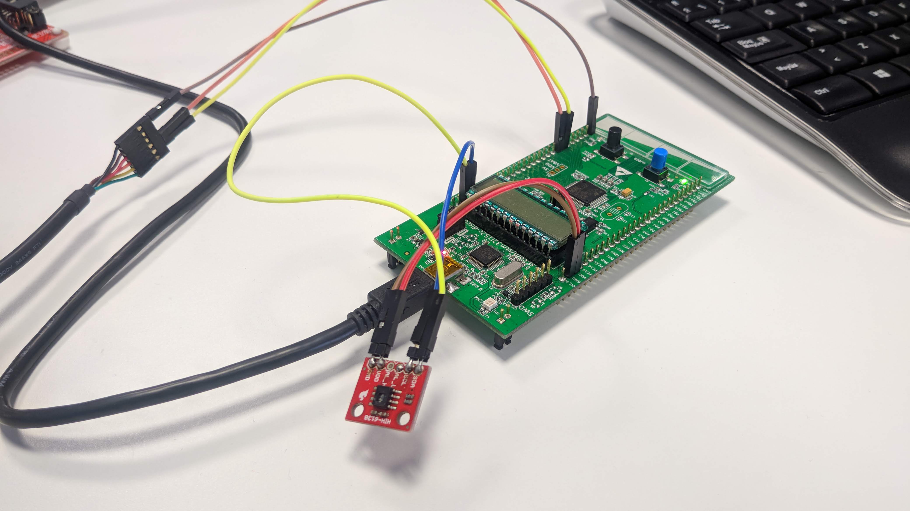

This document wants to be a small guideline for rapidly start using
the defconfig files we at ALR have updated. This `.defconfig` uses the
NuttX version 7.26.

# Available example list

## Olimex STM32-E407

- NSH over USB
- NSH over UART
- BMP180 through I2C
- HIH6130 through I2C
- TCP echo
- UDP Echo
- ADC
- Telemetry
- Power Manager
- SD Card
- MRF24J40-6LowPan through SPI
- Micro XRCE-DDS through serial


## STM32L Discovery

- NSH through UART
- BMP180 through I2C
- HIH6130 through I2C
- Power Manager
- Micro XRCE-DDS through serial


# Repositories to be used

For the examples listed below, please make use of the branch called `master` for NuttX folder, found at [GitHub](https://github.com/microROS/Nuttx), and the `master` [GitHub branch](https://github.com/microROS/apps) for the apps folder. Pull the branches in case you are working under the provided Dockerfiles.

----------------------

# How to configure and flash a board

We have developed two scripts that will help you to configure and flash the board easily. Go to the `NuttX` folder and write the next commands:

- To configure: `./scripts/configure.sh <board_model> <example_to_set>`
- To compile: `make`
- To flash: `./scripts/flash.sh <board_model>`

The configuration script will clean the previous project and set the new configuration.

The flash script will execute the proper command to upload the firmware to the board and execute it. The use of `OpenOCD` gives you the chance to debug the MCU.

# How to execute NSH under STM32L Discovery


Go to the main folder of NuttX and execute the next command to configure the board:
`./scripts/configure.sh stm32l1 nsh`

This script will clean NuttX and set the configuration that we need. You should see somenthing like this at the end.
```
  Copy files
  Refreshing...
```

Once the board is configure, the next step will be to compile the firmware:
Type `make` and you should see somenthing like this when it finished:
```
CP: nuttx.hex
CP: nuttx.bin
```

Now it's ready to upload the firmware to the board, so plug-in the micro USB cable an type the next command:
`./scripts/flash.sh stm32l1`

If everything goes right, will return the next message:
```
wrote 49152 bytes from file nuttx.bin in 6.279262s (7.644 KiB/s)
Info : Listening on port 6666 for tcl connections
Info : Listening on port 4444 for telnet connections
```

Connect the serial cable `RX` to pin `PA9` and `TX` to pin `PA10` and the GND wire to a `GND` pin.


Open a new terminal and use a serial client, i.e. `minicom` to open the serial port, `sudo minicom -D /dev/ttyUSB0`. Once done, you should be able to see how `NSH` pops up when pressing key:

```
nsh>
nsh>
nsh>
nsh> ?
help usage:  help [-v] [<cmd>]

  ?           exec        hexdump     mb          sleep       
  cat         exit        kill        mh          usleep      
  echo        help        ls          mw          xd          

Builtin Apps:
nsh>
```


# How to execute BMP180 example


### Olimex STM32-E407

Go to the main folder of NuttX and type the command to configure the board:
`./scripts/configure.sh olimex-stm32-e407 bmp180`

Compile:
`make`

Upload:
`./scripts/flash.sh olimex-stm32-e407`

### STM32L Discovery

Go to the main folder of NuttX and type the command to configure the board:
`./scripts/configure.sh stm32l1 bmp180`

Compile:
`make`

Upload the firmware:
`./scripts/flash.sh stm32l1`

In both cases it should return at the end somenthing like this:
- Configuration:
```
Copy files
Refreshing...
```
- Compilation:
```
CP: nuttx.hex
CP: nuttx.bin
```
- Upload the firmware
```
wrote 131072 bytes from file nuttx.bin in 3.763846s (34.008 KiB/s)
Info : Listening on port 6666 for tcl connections
Info : Listening on port 4444 for telnet connections
```
(The number of wrote bytes could be different in each board)


###  Olimex
Connect the sensor, as in the attached image:



### STM32L Discovery

Place Serial debugger RX(PA10), TX(PA9) and GND to GND, and connect the sensor `Vin` to `EXT_5V`, `GND` to `GND`, `SCL` to `PB9` and `SDA` to `PB8` (Board pin names, in silkscreen). For feeding the  sensor use the `EXT_5V` pin. Like in the image below:


In a new terminal, open a serial session attached to your serial cable, once you have done it, press "RESET" button. You should see NuttX console popping up:

```
NuttShell (NSH)                                                                 
nsh>
```
Now type `?`  command for checking if the example binary is there:

```
nsh> ?                                                                          
help usage:  help [-v] [<cmd>]                                                  

 [           cmp         false       mkdir       rm          true              
 ?           dirname     free        mh          rmdir       uname             
 basename    dd          help        mount       set         umount            
 break       df          hexdump     mv          sh          unset             
 cat         echo        kill        mw          sleep       usleep            
 cd          exec        ls          ps          test        xd                
 cp          exit        mb          pwd         time                          

Builtin Apps:                                                                   
 adc_simple                                                                    
 hello                                                                         
 helloxx                                                                       
 bmp180
```

Now, execute the example:

`nsh>bmp180`
This is the expected outoput:
```
Pressure: 95988                                                                 
Pressure: 95987                                                                 
Pressure: 95987                                                                 
Pressure: 95985                                                                 
Pressure: 95988
```

# How to execute HIH6130 example


Go to the main folder of NuttX and type the command to configure the board:
`./scripts/configure.sh olimex-stm32-e407 hih6130`

Compile:
`make`

Upload:
`./scripts/flash.sh olimex-stm32-e407`

### STM32L Discovery

Go to the main folder of NuttX and type the command to configure the board:
`./scripts/configure.sh stm32l1 hih6130`

Compile:
`make`

Upload the firmware:
`./scripts/flash.sh stm32l1`

In both cases it should return at the end somenthing like this:
- Configuration:
```
Copy files
Refreshing...
```
- Compilation:
```
CP: nuttx.hex
CP: nuttx.bin
```
- Upload the firmware
```
wrote 131072 bytes from file nuttx.bin in 3.763846s (34.008 KiB/s)
Info : Listening on port 6666 for tcl connections
Info : Listening on port 4444 for telnet connections
```
(The number of wrote bytes could be different in each board)

### Hardware connection

### Olimex

Connect the sensor as in the attached image:


Sensor `SDA` to `CON3` header `D0` pin
Sensor `SCL` to `CON3` header `D1` pin

Sensor `VIN` to `PD` header `19` pin
Sensor `GND` to `PD` header `20` pin

### STM32L Discovery

Connect the sensor as in the attached image:



Place Serial debugger RX(PA10), TX(PA9) and GND to GND, and connect the sensor `Vin` to `EXT_5V`, `GND` to `GND`, `SCL` to `PB9` and `SDA` to `PB8` (Board pin names, in silkscreen). For feeding the  sensor use the `EXT_5V` pin.

In a new terminal, open a serial session attached to your serial cable, once you have done it, press "RESET" button. You should see NuttX console popping up:

```
NuttShell (NSH)                                                                 
nsh>
```
Now type `?`  command for checking if the example binary is there:

```
nsh> ?                                                                          
help usage:  help [-v] [<cmd>]                                                  

 [           cmp         false       mkdir       rm          true              
 ?           dirname     free        mh          rmdir       uname             
 basename    dd          help        mount       set         umount            
 break       df          hexdump     mv          sh          unset             
 cat         echo        kill        mw          sleep       usleep            
 cd          exec        ls          ps          test        xd                
 cp          exit        mb          pwd         time                          

Builtin Apps:                                                                   
 adc_simple                                                                    
 hello                                                                         
 helloxx                                                                       
 hih6130
```

Now, execute the example:

`nsh>hih6130`
This is the expected outoput:
```
nsh> hih6130                                                                    
Temperature: 31 �ºC Humidity: 49                                                
Temperature: 31 �ºC Humidity: 45                                                
Temperature: 31 �ºC Humidity: 44                                                
Temperature: 31 �ºC Humidity: 44
```


# How to use NSH over UART

In the Olimex-STM32-E407 board, we have the chance to use system console throw USB or UART. In this guide, we will show how to use the UART console instead of the USB console.

First, we need to set the configuration, compile and upload the firmware to the board. So follow the next commands:

`./scripts/configure.sh olimex-stm32-e407 nsh_uart`

Compile:
`make`

Upload:
`./scripts/flash.sh olimex-stm32-e407`

At this point, the board is ready to be used, so you need to wire it:

`TTL232 TX` -> `USART3 RX`
`TTL232 RX` -> `USART3 TX`
`TTL232 GND` -> `Board GND`

It should look like this:


Once you finish the wiring, you need to connect the TTL232 to the PC, and with a tool like `minicom`, you can use the terminal.

```
NuttShell (NSH)
nsh> ?
help usage:  help [-v] [<cmd>]

  [           cmp         false       mkdir       rm          true        
  ?           dirname     free        mh          rmdir       uname       
  basename    dd          help        mount       set         umount      
  break       df          hexdump     mv          sh          unset       
  cat         echo        kill        mw          sleep       usleep      
  cd          exec        ls          ps          test        xd          
  cp          exit        mb          pwd         time        

Builtin Apps:
  helloxx
  adc_simple
  hello
nsh>
```


# How to execute telemetry app

Telemetry app ables to read the current measurement using INA219, CPU load and RAM size NuttX is using. For running this example you will require the INA219 connected to the bus `I2C1`, serial cable connected to `UART3` and the Olimex flashing tool attached:


First, clean the old compilations you are using:
`$ cd nuttx`
`$ make distclean`

Copy the `.config` file created for the example:
`cd nuttx/tools`
`./configure.sh olimex-stm32-e407/telemetry`
You should see this output in the terminal:

```
root@2ca837544dc0:~/nuttx/tools# ./configure.sh olimex-stm32-e407/telemetry
  Copy files
  Refreshing...
```

Finally, compile the example:
`cd .. && make`

Now upload the code to the board:
```
openocd -f interface/ftdi/olimex-arm-usb-tiny-h.cfg -f target/stm32f4x.cfg -c init -c "reset halt" -c "flash write_image erase nuttx.bin 0x08000000"
```
Once the code it's upload to the board, do the next steps:
+ Check if the example is there, type `?`, you should see a binary called `telemetry`

```
nsh>?
help usage:  help [-v] [<cmd>]

  [           dirname     help        mh          set         unset       
  ?           dd          hexdump     mount       sh          usleep      
  basename    df          kill        mv          sleep       xd          
  break       echo        ls          mw          test        
  cat         exec        mb          ps          time        
  cd          exit        mkdir       pwd         true        
  cp          false       mkfatfs     rm          uname       
  cmp         free        mkrd        rmdir       umount                                                                      

Builtin Apps:                                                                                                                 
  telemetry                                                                                                                   
  helloxx                                                                                                                     
  adc_simple                                                                                                                  
  hello
```

+ Now check its usage typing just `telemetry`:

```
nsh>telemetry                                                                                                                 
Correct: telemetry file.txt number_measures show_option                                                                       
If you want a continue measure, write i as argument                                                                           
The available options are:                                                                                                    
 s (to save in the sd card)                                                                                                   
c (to see the data in the console)                                                                                            
 b (both modes)

```

In this example, we are not going to store any file with the measurements, but we need to type it.
Execute the next command:  `telemetry file.txt 10 c` to see 10 reads in the console.
The output should be something like this:

```
nsh>telemetry file.txt 10 c                                                                                                   
nsh: mount: mount failed: 19                                                                                                  
Starting telemetry SD                                                                                                         
V: 1028000 mV I: 4294966496 mA CPU:   0.01000235516tal       used       free    largest                                       
Umem:       127072      17088     109984     105968                                                                           
�tK��Q Free SRAM: 109984 Bytes                                                                                                
V: 1024000 mV I: 4294966496 mA CPU:   0.01000235516tal       used       free    largest                                       
Umem:       127072      17088     109984     105968                                                                           
�tK�����Q Free SRAM: 109984 Bytes                                                                                             
V: 1028000 mV I: 4294966696 mA CPU:   0.01000235516tal       used       free    largest                                       
Umem:       127072      17088     109984     105968                                                                           
�tK��Q Free SRAM: 109984 Bytes                                                                                                
V: 1024000 mV I: 4294966396 mA CPU:   0.01000235516tal       used       free    largest                                       
Umem:       127072      17088     109984     105968                                                                           
�tK�����Q Free SRAM: 109984 Bytes                                                                                             
V: 1024000 mV I: 4294966296 mA CPU:   0.01000235516tal       used       free    largest                                       
Umem:       127072      17088     109984     105968                                                                           
�tK��Q Free SRAM: 109984 Bytes                                                                                                
V: 1024000 mV I: 4294966896 mA CPU:   0.01000235516tal       used       free    largest                                       
Umem:       127072      17088     109984     105968                                                                           
�tK�����Q Free SRAM: 109984 Bytes                                                                                             
V: 1024000 mV I: 4294966596 mA CPU:   0.01000235516tal       used       free    largest                                       
Umem:       127072      17088     109984     105968                                                                           
�tK��Q Free SRAM: 109984 Bytes                                                                                                
V: 1028000 mV I: 4294966496 mA CPU:   0.01000235516tal       used       free    largest                                       
Umem:       127072      17088     109984     105968                                                                           
�tK�����Q Free SRAM: 109984 Bytes                                                                                             
V: 1024000 mV I: 4294966696 mA CPU:   0.01000235516tal       used       free    largest                                       
Umem:       127072      17088     109984     105968                                                                           
�tK��Q Free SRAM: 109984 Bytes                                                                                                
V: 1028000 mV I: 4294966796 mA CPU:   0.01000235516tal       used       free    largest                                       
Umem:       127072      17088     109984     105968                                                                           
�tK�����Q Free SRAM: 109984 Bytes
```
*Note: It is not required to add SD card to run the example. But you can add it and create a logfile*
*Note: Current and Voltage measurements are weird because I haven't attached anything*
*Note: This test needs improvements*

# How to execute UDPEcho server example

Go to the main folder of NuttX and type the command to configure the board:
`./scripts/configure.sh olimex-stm32-e407 udpecho`

Compile:
`make`

Upload:
`./scripts/flash.sh olimex-stm32-e407`

This might be the results:

- Configuration:
```
Copy files
Refreshing...
```
- Compilation:
```
CP: nuttx.hex
CP: nuttx.bin
```
- Upload the firmware
```
wrote 131072 bytes from file nuttx.bin in 3.763846s (34.008 KiB/s)
Info : Listening on port 6666 for tcl connections
Info : Listening on port 4444 for telnet connections
```

Once the code it's upload to the board, do the next steps:
- Connect the ethernet cable to the ethernet port of the board.
- Connect the mini USB cable to the USB_OTG 1 port.


- Configure the console with a baudrate of 115200 bauds.
- Once you open the console you should check if the app was correctly upload typing `?` and you should see this:


- Then type `ifup eth0` to bring up the network:


- Mount the file system of NuttX typing `mount -t procfs /proc`
- See which IP was assigned to your board typing `ifconfig` and you should see this:


With this command, you can see statistics of the network, the IP of the board, the state of the connection...
In this case was assigned the IP: 192.168.1.35
**By default this board will use the port 80.** To change it, you must do in the code of the app

- The last step in the board side is to type `udpecho` to run the udp echo server.
-Then in the computer side, use an app like netcat typing the next command: `netcat -u 192.168.1.35 80`

Now if you type something in the computer, the board should echo the same and show the data of the messages like this image:

**Computer side**


**Board side**


# How to execute TCP Echo server example


Go to the main folder of NuttX and type the command to configure the board:
`./scripts/configure.sh olimex-stm32-e407 tcpecho`

Compile:
`make`

Upload:
`./scripts/flash.sh olimex-stm32-e407`

This might be the results:

- Configuration:
```
Copy files
Refreshing...
```
- Compilation:
```
CP: nuttx.hex
CP: nuttx.bin
```
- Upload the firmware
```
wrote 131072 bytes from file nuttx.bin in 3.763846s (34.008 KiB/s)
Info : Listening on port 6666 for tcl connections
Info : Listening on port 4444 for telnet connections
```

Once the code it's upload to the board, do the next steps:
- Connect the ethernet cable to the ethernet port of the board.
- Connect the mini USB cable to the USB_OTG 1 port.

*Note:This example has been made with a router in the middle of the computer and the Olimex board.*

Once you reset the board, it should appear the NSH console and if you type  `?` you should see the application `tcpecho`.


You need to bring up the network:


Type `ifconfig` and you will see the IP.


Finally execute the App it should return:
```
Start Echo Server

```

Then in your computer you can open an TCP/Ip client with the next command in the console:
` netcat -t 192.168.1.133 80`

This command connects to the IP 192.168.1.133 and the port 80

Now right some characters in the terminal:

```
~$ netcat -t 192.168.1.133 80
sfd
sfd
aaa
aaa
jjj
jjj
```

At the client, in your computer, you should see the reply of what you're writing.

If you want to check or modify the connection data  you can do in the next path:
`make menuconfig`

`Application configuration`

`Examples`

And you will see something like this:


This show the IP direction, the netmask and the router IP in HEX and the port to connect.

The variables are shown in two hexadecimal numbers per each field. In case of the IP:
`0xCA` = 192

`0xA8` = 168

`0x01` = 1

`0x85` = 133

# How to execute Power Manager example

This example is simple, after some seconds, the boards enter into a sleep mode that could be re-waken up, writing into the serial season. Some data is lost, until the complete wake up is done.


### Olimex STM32-E407

Go to the main folder of NuttX and type the command to configure the board:
`./scripts/configure.sh olimex-stm32-e407 pm`

Compile:
`make`

Upload:
`./scripts/flash.sh olimex-stm32-e407`

### STM32L Discovery

Go to the main folder of NuttX and type the command to configure the board:
`./scripts/configure.sh stm32l1 pm`

Compile:
`make`

Upload the firmware:
`./scripts/flash.sh stm32l1`

In both cases it should return at the end somenthing like this:
- Configuration:
```
Copy files
Refreshing...
```
- Compilation:
```
CP: nuttx.hex
CP: nuttx.bin
```
- Upload the firmware
```
wrote 131072 bytes from file nuttx.bin in 3.763846s (34.008 KiB/s)
Info : Listening on port 6666 for tcl connections
Info : Listening on port 4444 for telnet connections
```
(The number of wrote bytes could be different in each board)

Now open a serial session for connecting to the board. Once the prompt pops-up, do not type for some seconds and you will see that in a point, if you type something, it will not appear at the command line. After some seconds, the command line will again work properly.

# How to execute micro-XRCE-DDS

In this example, we can try micro-XRCE-DDS running in NuttX. This example runs the Shape Demo.
For this demo we need two boards (It doesn't matter if it's the Olimex Board or the STM32L1), one will be the publisher which will send a topic with a shape, the color of the shape and the coordinate of the shape. The other board will subscribe to the topic.
At this moment it's only possible to work throught serial, but it could be possible to use with UDP and TCP.

### Olimex STM32-E407

Go to the main folder of NuttX and type the command to configure the board:
`./scripts/configure.sh olimex-stm32-e407 microxrcedds`

Compile:
`make`

Upload:
`./scripts/flash.sh olimex-stm32-e407`

### STM32L Discovery

Go to the main folder of NuttX and type the command to configure the board:
`./scripts/configure.sh stm32l1 microxrcedds`

Compile:
`make`

Upload the firmware:
`./scripts/flash.sh stm32l1`

In both cases it should return at the end somenthing like this:
- Configuration:
```
Copy files
Refreshing...
```
- Compilation:
```
CP: nuttx.hex
CP: nuttx.bin
```
- Upload the firmware
```
wrote 131072 bytes from file nuttx.bin in 3.763846s (34.008 KiB/s)
Info : Listening on port 6666 for tcl connections
Info : Listening on port 4444 for telnet connections
```
(The number of wrote bytes could be different in each board)

At this point the board is ready to work, and we need to attach the next cables:

### Olimex STM32-E407

Connect the miniUSB to the USB-OTG1 to have access to the console.
Then we need to connect to the USART3, so follow this diagram:
- `USART3 TX` -> `TTL232 RX`
- `USART3 RX` -> `TTL232 TX`
- `GND Board` -> `TTL232 GND`

And it should look like this:


### STM32LDiscovery

For this board we need two TTL232 cable.
The first one is to show the console, and you need to do the next wiring:
Connect the serial cable `RX` to pin `PA9` and `TX` to pin `PA10` and the GND wire to a `GND` pin.

Then you need to connect to the second UART to use micro-XRCE-DDS:
Connect the serial cable `RX` to pin `PA2` and `TX` to pin `PA3` and the GND wire to a `GND` pin.

And it should look like this:


In this example, we use an Olimex board and a STM32L1 Board, but you can use any combination between STM32L1, Olimex Board and PC.
Now we're going to execute the Agent in the PC.
First, we need to check the port number of the serial cable that we want to use as micro-XRCE-DDS interface.
Note: You must installed micro-XRCE-DDS agent previously, follow this guide -> https://micro-xrce-dds.readthedocs.io/en/latest/installation.html

Open a console and type the next command:
`MicroXRCE-DDSAgent serial <serial_port>`

If you're using the Olimex Board you need to type the command in the console:
`client --serial /dev/ttyS0`
Otherwise, if you using the STM32LDiscovery board, you need to use this command:
`client --serial /dev/ttyS1`

Now to set a board as **Publisher**, you need to use the next commands:
> create_session
> create_participant 1
> create_topic 1 1
> create_publisher 1 1
> create_datawriter 1 1

If you want to be **Subscriber** you need to use the next commands:
> create_session
> create_participant 1
> create_topic 1 1
> create_subscriber 1 1
> create_datareader 1 1

To publish a topic, you need to write this command:
> write_data 1 128 200 200 40 BLUE

To receive a data in the subscriber, you need to write this command:
> request_data 1 128 1

You can find detailed information on this page:
https://micro-xrce-dds.readthedocs.io/en/latest/index.html

Important note: For each client that you want to run, you need to run an agent in PC.
For example:
We have the STM32L1 as publisher, so we need to check the serial port number of the microXRCEDDS serial interface and run an Agent in the PC.
Then We have the Olimex as subscriber, so we need to follow the same steps as with the STM32L1 board.

# How to use MRF24j40-6LowPan

With this demo, we'll be able to create a point to point connection with the  MRF24J40 module using the protocol 66LowPan. This network, allows you to have hundreds of nodes with very little power consumption.
One of the nodes is a TCP or UDP server, and the other nodes are TCP or UDP clients that they connect to the server.

Go to the main folder of NuttX and type the command to configure the board:
`./scripts/configure.sh olimex-stm32-e407 mrf24j40-6lowpan`

Compile:
`make`

Upload:
`./scripts/flash.sh olimex-stm32-e407`

It should return somenthing like this:

- Configuration:
```
Copy files
Refreshing...
```
- Compilation:
```
CP: nuttx.hex
CP: nuttx.bin
```
- Upload the firmware
```
wrote 131072 bytes from file nuttx.bin in 3.763846s (34.008 KiB/s)
Info : Listening on port 6666 for tcl connections
Info : Listening on port 4444 for telnet connections
```
(The number of wrote bytes could be different in each board)

Once the firmware was configured and uploaded, we need to set the next pinout:
- `Board D13` -> `MRF24J40 SCLK`
- `Board D12` -> `MRF24J40 MISO`
- `Board D11` -> `MRF24J40 MOSI`
- `Board D10` -> `MRF24J40 CS`
- `Board D8` -> `MRF24J40 INT`

Finally connects the mini-USB cable to the USB OTG1, and the board should look like this:


Once the wiring is ready, open a console and you should see this:


First we need to type the next command in both boards to bring-down the connection: `ifdown wpan0`

We already know that we have two different roles, **Client** and **Server**. So we need to configure each board with his role:
**- Server Configuration:**
- `i8sak wpan0 startpan cd:ab `
- `i8sak set chan 11`
- `i8sak set panid cd:ab `
- `i8sak set saddr 42:01 `
- `i8sak acceptassoc  `

Now it's time to configure the client. It's important to follow this configuration order.
**- Client Configuration:**
- `i8sak wpan0`
- `i8sak set chan 11 `
- `i8sak set panid cd:ab `
- `i8sak set saddr 42:02  `
- `i8sak set ep_saddr 42:01`
- `i8sak assoc`

If everything goes fine, you should see somenthing like this:
**Server Board**


**Client Board**


It only left to bring-up the network, so type this command in both boards: `ifup wpan0`.

At this point, the set-up is complete and it's the moment to use the UDP server and client to have a communication between the boards.
So, first we need to know the IP of the server board. Type the next commands in the server board:
- `mount -t procfs /proc`
- `ifconfig`

You should see somenthing like in the image. The red square is the IP of the board.


Finally in the Server board, execute the Server, typing:
- `udpserver &`


Now the UDP server, it's ready to work.

To use the UDP client, we need to type the next command in the client board:
- `udpclient <IP of the server board>`


Now the UDP Client, will send a HelloWorld to the UDP Server.


# How to use a micro SD-Card in the Olimex-STM32-E407 board:

This demo it's only for the Olimex board. In this demo we will be able to write and read files from a SD card.

To configure type the next command in the main folder of NuttX:
- `./scripts/configure.sh olimex-stm32-e407 sd`

Compile it:
- `make`

Upload the firmware to the board:
- `./scripts/flash.sh olimex-stm32-e407`

This demo doesn't require any special wiring, only connects the mini-USB cable to the USB-OTG port and introduce the SD-Card before power on the board.
This board doesn't have automatic detection of insertion or extraction of SD-Card.

Once you're in the console, type `ls /dev` to see if the card was register:


The `mmcsd0` is the SD card.

The next step is to mount the file SD-Card file system, so it's necessary to write the next command:
`mount -t vfat /dev/mmcsd0 /mnt`

Now it's ready to use the SD Card, so you have available the next commands:
- See the files available: `ls /mnt`
- Read a file: `cat /mnt/<name_of_the_file>`
- Write or createa file: `echo "Content to write" > /mnt/name_of_your_file`

# How to use an auxiliary UART:

In this demo we will show to use an auxiliary UART to send and receive message.
When we run this demos, we will send the first argument to the auxiliar terminal and we will wait for an input from the auxiliar terminal.

Note: The STM32L1Discovery board can use a auxiliary port, but the application it's not compatible.

You need to configure, compile and upload the firmware, so execute the next commands:
- `./scripts/configure.sh olimex-stm32-e407 aux_serial`
- `make`
- `./scripts/flash.sh olimex-stm32-e407`

For this demo we need to connect a USB cable to the miniUSB port and a serial cable (TTL232) to the UART3 with the next pinout:

- `USART3 TX` -> `TTL232 RX`
- `USART3 RX` -> `TTL232 TX`
- `GND Board` -> `TTL232 GND`

And it should look like this:


Start the board, find which is the port of the auxilary serial cable and open a terminal in that port.
Init the application `aux_serial <message_to_send>`.

The message will appear in the other terminal and you need to push any key in the terminal to unlock the board console.
This image is the board console:


This image is the auxilary console:


# How to use the ADC demo:

In this demo we will take the analog value pin A1 /ADC3 channel 4 (The internal name). This demo only works in the Olimex board.

First we need to configure, compile and upload the firmware:

- `./scripts/configure.sh olimex-stm32-e407 mrf24j40-6lowpan`

To compile:
- `make`

To upload:
- `./scripts/flash.sh olimex-stm32-e407`

For this demo it's only necessary to connect a mini-USB cable to the USB-OTG 1 port, to see the console.
Once you run the console, you should see this apps:


If you execute the application typing `adc_simple`, you will see a mesaure of the A1 pin every 100ms like in the image:


# How to use  microROS demo:

In this demo, we will use the alpha version of microROS for NuttX running under the Olimex-STM32-E407 board.
With board running this demo we could create a ROS2 publisher or a ROS2 subscriber.
The publisher will create an publish as a topic a progressive count of integers (From 0 to 1000).
The subscriber will subscribe to that topic and will show the value of the number published.

This demo is a little bit different as the other demo because we need to follow another path to configure it.
We need to download the docker files of microROS, executing the next command:
`git clone -b features/micro-ros https://github.com/microROS/docker`
(Note: This repository might change of location)

Now it's necessary to build the docker file, so type the next command:
`docker build -t microros_stm32f4 .`
If everything goes right, you should run this command to start the docker:
`docker build -t microros_stm32f4 `

At this point it only left to upload the precompile firmware to the board, typing the next commands:
`cd nuttx`
`openocd -f interface/ftdi/olimex-arm-usb-tiny-h.cfg -f target/stm32f4x.cfg -c init -c "reset halt" -c "flash write_image erase nuttx.bin 0x08000000"`

Once the firmware is ready and uploaded, you need to connect the miniUSB cable to the USB-OTG1 and connect the serial cable(TTL232) to USART3 with the next pinout:
- `USART3 TX` -> `TTL232 RX`
- `USART3 RX` -> `TTL232 TX`
- `GND Board` -> `TTL232 GND`

And it should look like this:


Now the board it's ready.
Connect the serial cable (TTL232) to the computer and check which is the number of the serial port.

Note: We need to install previosly the microROS agent. So you can follow the next guide to install it:
https://github.com/microROS/micro-ROS-doc/blob/master/docs/install_and_run.md

## Run a publisher:

First you need to execute the **microROS Agent** in your computer using the next command:
```
cd ~/agent_ws/install/uros_agent/lib/uros_agent/
./uros_agent serial <direction_of_serial>
```

Once you execute it should look like this:


Now execute the publisher app in the Olimex board, typing `publisher`, and should send a new value every 100mS. And will look like this:

**Agent**


**Board publisher**


Finally, if you type in a console `ros2 topic list`, you will be able to see the topic like in the image:


## Run a publisher:


To run this example, you should follow the same steps as in the previous (Run a publisher), instead of run the `publisher` app, you should run `subscriber` app.

If the publisher is running properly, you should see this on the board:


So as a summary:
- With this demo, you can run a publisher or subscriber in the Olimex Board.
- You need to run an agent for each publisher or subscriber that you want to run.
- You can create a ROS2 subscriber in the PC and receive the topic.
- The topic that sends this example is an integer that goes from 0 to 1000.
